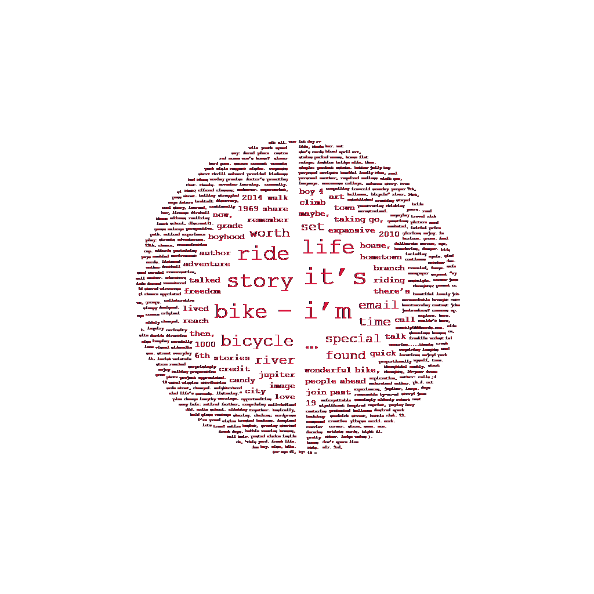
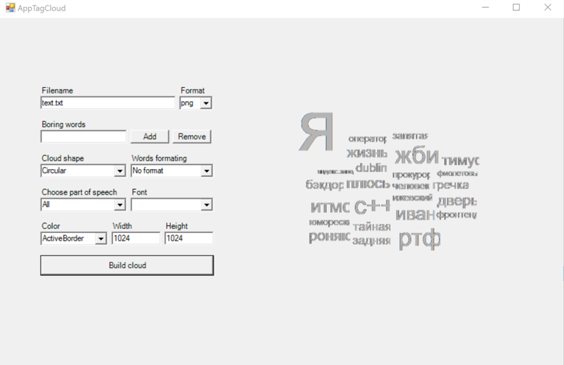

# Tag cloud


App for building tag cloud from text file, with GUI.\
In future I'll implement 3 extension points, changing of:
  * Cloud form
  * Font
  * Color of words\
This features was implemented:
  * Changing of size of image
  * Add and remove forbidden words to dictionary

# How to run?
 1. Build project, .NET 7.2
 2. Run TagCloudBuilder.App.exe
 3. Put .txt file in TagCloudBuilder.App\Resources
 4. Press build button to create cloud
 5. You can find it in TagCloudBuilder.App/bin/Release(or Debug)

# Directory tree
  ```
  ├── TagCloudBuilder
  |   ├── Domain
  |   |   ├── CloudBuilder
  |   |   ├── CircularCloudLayouter
  |   |   ├── Cloud  
  |   |   ├── Settings
  |   |   ├── TextRectangle  
  |   |   └── WordsBounder  
  |   └── Infrastructure
  |      ├── ParseResultExtensions
  |      ├── PointExtensions
  |      ├── PunctuationParser
  |      ├── TxtReader
  |      ├── WordsEditor
  |      ├── WordsFilter
  |      ├── Quarter
  |      ├── Result
  |      └── ResultQueryExpressionExtensions
  ├── TagCloudBuilder.App
  |   ├── Resourses
  |   |   ├── stopwords.txt
  |   |   └── ...(тексты ввода)
  |   ├── AppTagCloud
  |   ├── ForRegister
  |   ├── PngDrawer
  |   └── Program
  └── TagCloudBuilder.Tests
      ├── CircularCloudBuilder_Should
      ├── CircularCloudLayouter_Should
      ├── CloudDrawer
      ├── Result_Should
      ├── ResultQueryExpression_Should
      ├── TxtReaderShould
      └── WordsFilterShould

  ```

# UI
  
